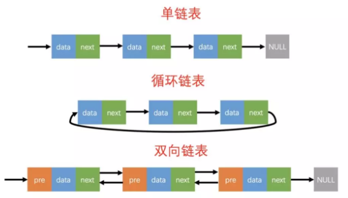

## 数组
1. 概念：相同类型的元素的集合所组成的数据结构，分配一块连续的内存来储存。
2. 优点： ①按照索引查询元素速度快 ②按照索引表里元素方便。
3. 缺点： ①数组大小固定后无法扩容 ②数组只能储存一种类型的数据。
4. 使用场景：频繁查询，对储存空间要求不大，很少增加和删除的情况。

## 栈 
1. 一种特殊的线性表，仅能在线性表的一端操作。栈顶允许操作，栈底不允许操作。**后进先出**。
2. 进栈：从栈顶放入元素   出栈：从栈顶取出元素
3. 使用场景：常用于实现递归功能场景（斐波那切数列）

## 队列
1. 一种线性表，队列可以在一端添加元素，在另一端取出元素。**先进先出**。（入队，出队）

## 堆
1. 比较特殊的数据结构，可以看做数组对象堆又被称为优先队列。（不是队列）**队尾插入，队头出**（不是栈，堆元素中的排列按照一定的优先顺序排列）
2. 堆的一个经典实现是完全二叉树，这样的实现被称为二叉堆
3. 满二叉树：除了叶子节点，所有的子节点不为空
4. 完全二叉树：不一定是个满二叉树，不满的部分一定在右下侧
> https://juejin.im/post/6866970001409064967#heading-12 

## 链表
1. 链表是物理储存单位上非连续的，非顺序的储存结构。数据元素的逻辑顺序是通过链表的指针地址实现的，每个元素包含两个特点，一个是储存元素的数据域（储存空间），一个是指向下一个节点地址的指针域。
2. 优点：①不需要初始化，可以任意加减元素。②添加删除快，只需要改变前后两个元素节点的指针域的指向地址。
3. 缺点：①含有大量的指针域，占用空间比较大。②查找时需要遍历，非常耗时。
4. 使用场景：数据量小，需要频繁的添加或删除。
5. 链表的分类：单链表 循环链表 双向链表

6. 添加：尾插法（将链表的左边称为链表头部），头插法
7. 查询：双向列表的灵活之处就是，知道链表中的一个元素，就可以想左或者向右开始遍历查找需要的元素结构。有序链表的双向链表按值查询的效率比单向链表的高，查找时可以记录上次的查找的位置p，根据查找时与p的关系，再决定往前还是往后查找。（平均只需要查找一半数据）
8. 删除：①删除节点中“值等于某个值”的节点。②删除给定指针指向节点（单向的时间复杂度高，因需要遍历）
9. 双向循环列表

## 散列表
1. 散列表，也叫哈希表。根据关键码和值（key, value）直接进行访问的数据结构。通过key和value来映射到集合中的一个位置。
2. 记录储存位置f(key)。对应关系的f为散列函数（哈希函数）。散列表就是把key通过一个固定的算法函数即所谓的哈希函数转化为一个整形数字，然后就将该数字对数组长度进行取余，取余结果就当作数组的下标，将value存储在以该数字为下标的数组空间里，这种存储空间可以充分利用数组的查找优势来查找元素，所以查找的速度很快。
