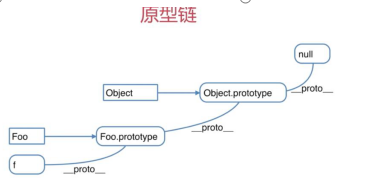
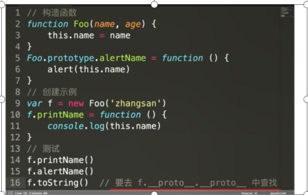
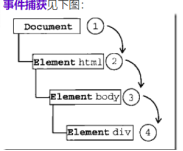
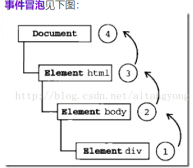
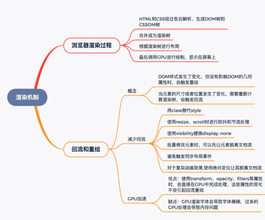
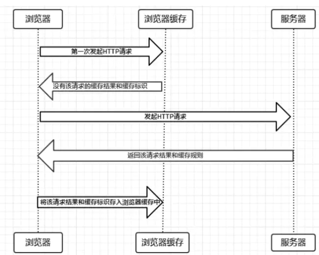
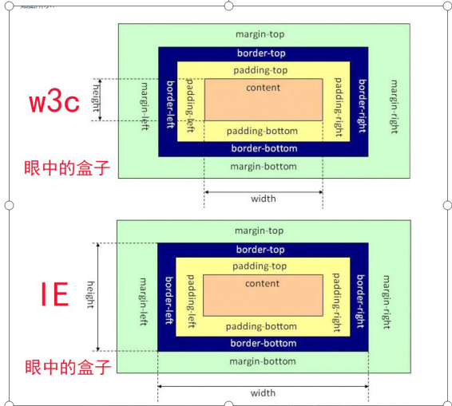

## 1. Event事件绑定（监听事件）
- W3C规范中定义了3个事件阶段，依次是捕获阶段、目标阶段、冒泡阶段。
```
element.addEventListener(event, function, useCapture)

//event : （必需）事件名，支持所有DOM事件。

//function：（必需）指定要事件触发时执行的函数。

//useCapture：（可选）指定事件是否在捕获或冒泡阶段执行。true，捕获。false，冒泡。默认false。

//注：IE8以下不支持。

<input type="button" value="click me" id="btn1">

<script>
document.getElementById("btn1").addEventListener("click",hello);
function hello(){
    alert("hello world!");
}
</script>
```


- 可以解除相应的绑定
```
<input type="button" value="click me" id="btn5">

<script>
var btn5 = document.getElementById("btn5");
btn5.addEventListener("click",hello1);//执行了
btn5.addEventListener("click",hello2);//不执行
btn5.removeEventListener("click",hello2);

function hello1(){
    alert("hello 1");
}
function hello2(){
    alert("hello 2");
}
</script>

```


- IE
```
element.attachEvent(event, function)
//event：（必需）事件类型。需加“on“，例如：onclick。
 
//function：（必需）指定要事件触发时执行的函数。
 
<input type="button" value="click me" id="btn2">
 
<script>
document.getElementById("btn2").attachEvent("onclick",hello);
function hello(){
    alert("hello world!");
}
</script>
```

## 2. Object.assign() Object.keys()
1. 方法用于将所有可枚举属性的值从一个或多个源对象复制到目标对象。它将返回目标对象。`Object.assign(target, ...sources)`
```
const target = { a: 1, b: 2 };
const source = { b: 4, c: 5 };

const returnedTarget = Object.assign({可有默认值},target, source);
// target目标对象。 sources源对象。

console.log(target);
// expected output: Object { a: 1, b: 4, c: 5 }
console.log(returnedTarget);
// expected output: Object { a: 1, b: 4, c: 5 }


Object.assign(
                        {}, 
                        this.state.params, 
                        { 
                            num: this.state.putInHighSeasonValue,
                            classes: type,
                            userId: userInfo.userId 
                        }
                    )


```
2. 方法会返回一个由一个给定对象的自身可枚举属性组成的数组，数组中属性名的排列顺序和正常循环遍历该对象时返回的顺序一致 。
```
// simple array
var arr = ['a', 'b', 'c'];
console.log(Object.keys(arr)); // console: ['0', '1', '2']

// array like object
var obj = { 0: 'a', 1: 'b', 2: 'c' };
console.log(Object.keys(obj)); // console: ['0', '1', '2']

// array like object with random key ordering
var anObj = { 100: 'a', 2: 'b', 7: 'c' };
console.log(Object.keys(anObj)); // console: ['2', '7', '100']
```


## 3. instanceof，hasOwnProperty，in，isArray, for-in
1. instanceof
- 用于检测构造函数的 prototype 属性是否出现在某个实例对象的原型链。

- **运算符用来测试一个对象在其原型链中是否出现一个构造函数的 prototype 属性**

- instanceof只适用于构造函数创建返回的复杂对象和实例。
>任何时间判断一个对象（复杂值）是否是Object的实例时，它都将返回true，因为所有对象都继承自Object()构造函数。  
>instanceof使用场景，判断在一个继承关系中实例是否属于它的父类。
```
// 实例
let oSon = new oFather();
console.log(oSon instanceof oFather); // true

// 继承
let nFather = function () {};
nFather.prototype = new oFather();
nFather.construction = nFather;
console.log(nFather.firstName); // undefined
console.log(nFather.prototype.lastName); // qian
console.log(nFather instanceof oFather); // false
console.log(new nFather() instanceof nFather); // true

// 相对于Object来说
console.log('123' instanceof Object); // false
console.log(new String('123') instanceof Object); // true 构造出来的实例
console.log(null instanceof Object); // false
```

2. in, hasOwnProperty
- in操作符可以检查一个对象的属性，包括来自原型链的属性
- hasOwnProperty()方法可以检查来自非原型链属性的对象

- 实际项目中经常使用for...in...来遍历对象中可枚举的属性，但是for...in...常常把原型obj.prototype.xxx中的属性也列举出来，所以在循环的时候可以加上hasOwnProperty()方法判断下。
```
function obj0 () {
    this.name = 'mazey',
    this.age = '24'
};
obj0.prototype.gender = 'male';
let obj1 = new obj0();

// 打印所有可枚举属性
for (let key in obj1) {
    console.log(key); // name age gender 从原型链上继承下来的属性也会被打印出来
}

// 过滤掉原型链上的属性
for (let key in obj1) {
    if (obj1.hasOwnProperty(key)) {
        console.log(key); // name age
    }
}
```

3. isArray
- isArray() 方法用于判断一个对象是否为数组，如果对象是数组返回 true，否则返回 false。
- Array.isArray(obj)  // obj必需，要判断的对象。

4. includes
- 方法用来判断一个数组是否包含一个指定的值，根据情况，如果包含则返回 true，否则返回 false
- [1,2].includes(1)  
## 4.JS阻止冒泡和取消默认事件(默认行为)

- js冒泡和捕获是事件的两种行为，使用event.stopPropagation()起到阻止捕获和冒泡阶段中当前事件的进一步传播。
>w3c的方法是e.stopPropagation()，IE则是使用e.cancelBubble = true
```
var el = window.document.getElementById("a");
el.onclick = function (e) {
    //如果提供了事件对象，则这是一个非IE浏览器
    if (e && e.stopPropagation) {
        //因此它支持W3C的stopPropagation()方法
        e.stopPropagation();
    }
    else {
        //否则，我们需要使用IE的方式来取消事件冒泡 
        window.event.cancelBubble = true;
        return false;
    }
}
```
- 使用event.preventDefault()可以取消默认事件
```
var el = window.document.getElementById("a");
el.onclick = function (e) {
    //如果提供了事件对象，则这是一个非IE浏览器
    if (e && e.preventDefault) {
        //阻止默认浏览器动作(W3C) 
        e.preventDefault();
    }
    else {
        //IE中阻止函数器默认动作的方式 
        window.event.returnValue = false;
        return false;
    }
}
```

>冒泡事件：比如我们点击了一个元素然后从它本身开始一层一层向上的父元素都做出反应直到根元素  
默认事件：像a标签的点击跳转和页面鼠标右键单击弹出菜单等都是默认事件

## 5. 分割子串
- 不以使用正则表达式来替代子串，使用子串构建正则时，有可能有特殊字符
```
const s = 'foo foo foo'
s.replce(/foo/g, 'bar')


// 期待结果: 'AhelloX hello3 '
'hello. helloX hello3 '.replace(new RegExp('hello. ', 'g'), 'A')
// 返回结果 "AAA"

方法一
'hello. hello. hello. '.split('hello. ').join('A')
"AAA"

方法二
String.prototype.replaceAll()
'aabbcc'.replaceAll('b', '.'); 
// 'aa..cc'
```


## 6.EventLoop-宏队列和微队列及其执行顺序
#### EventLoop事件循环机制： 浏览器或者node的一种解决JavaScript单线程运行时不会阻塞的一种机制，也就是异步原理。
- 宏任务队列可以有多个，微任务队列只有一个；主线程上的任务就是第一个宏任务，即刚进来时候的 script； 
```
宏队列（macrotask，也叫tasks）：能够建立宏任务的有
setTimeout
setInterval 
setImmediate (Node独有) 
requestAnimationFrame (浏览器独有) 
I/O UI rendering (浏览器独有)。

微队列（microtask，也叫jobs）： 能够建立微任务的有
process.nextTick (Node独有) 
Promise 
Object.observe 
MutationObserve 

当有一个宏任务队列执行完毕后，会执行微任务队列中的全部内容，然后执行另一个宏任务，如此反复
```
- 执行过程
1. 首先js会执行非异步操作的执行栈中的任务；
2. 执行栈中所有任务全部执行完毕后会在宏队列(宏队列中的任务执行先进先出策略)中取出队列顶部的任务放到执行栈中；
3. 在执行当前macrotask任务时，如果发现有microtask(微队列)，直接将任务放到微队列(微队列同样执行先进先出策略)中，等待当前宏队列任务执行完毕后执行。
4. 执行完当前栈顶的宏队列任务后，不会接着执行下面的宏队列任务，而是接着执行微队列中的任务，直到所有微队列任务全部执行完毕，再执行下一个宏队列任务。
5. 直到所有宏队列任务执行完毕，微队列任务执行完毕。

>marcotask 的本质是浏览器多个线程之间通信的一个消息队列；在 chrome 里，每个页面都对应一个进程，该进程又有多个线程，比如 js 线程、渲染线程、io 线程、网络线程、定时器线程等等，这些线程之间的通信是通过向对象的任务队列中添加一个任务（postTask） 来实现的；

>浏览器的各种线程都是常驻线程，他们运行在一个 for 死循环里面，每个线程都有属于自己的若干任务队列，线程自己或者其它线程都可能通过 postTask 向这些任务队列添加任务，这些线程会不断的从自己的任务队列中取出任务执行，或者把处于睡眠状态直到设定的时间或者是有人 postTask 的时候把它唤醒；

>microtask 是确确实实存在的一个队列，microtask 是属于当前线程的，而不是其他线程 postTask 过来的任务。只是延迟执行了而已，比如 Promise.then、mutationObserve 都属于这种情况；

## 7. Promise
1. 
- 出现原因： 根据上一个请求执行下一步请求，产生回调地狱
    ```
    请求1(function(请求结果1){
        请求2(function(请求结果2){
            请求3(function(请求结果3){
                请求4(function(请求结果4){
                    请求5(function(请求结果5){
                        请求6(function(请求结果3){
                            ...
                        })
                    })
                })
            })
        })
    })
    ```
- 缺点  
    代码臃肿。  
    可读性差。  
    耦合度过高，可维护性差。  
    代码复用性差。   
    容易滋生 bug。  
    只能在回调里处理异常 
2. 
- Promise： 异步编程解决方案（ promise有三种状态：pending(等待态)，resolved（fulfiled）(成功态)，rejected(失败态)；状态一旦改变，就不会再变。创造promise实例后，它会立即执行。）
```
new Promise(resolve => {
  setTimeout(() => {
    resolve('hello')
  }, 2000)
}).then(res => {
  console.log(res)
})
```

```
new Promise(resolve => {
    setTimeout(() => {
      resolve('hello')
    }, 2000)
  }).then(val => {
    console.log(val) //  参数val = 'hello'
    return new Promise(resolve => {
      setTimeout(() => {
        resolve('world')
      }, 2000)
    })
  }).then(val => {
    console.log(val) // 参数val = 'world'
  })
```

```
// promise完成后then()
let pro = new Promise(resolve => {
   setTimeout(() => {
     resolve('hello world')
   }, 2000)
 })
 setTimeout(() => {
   pro.then(value => {
   console.log(value) // hello world
 })
 }, 2000)
```

```
// Promise 状态的不可逆性
var p1 = new Promise(function(resolve, reject){
  resolve("success1");
  resolve("success2");
});

var p2 = new Promise(function(resolve, reject){
  resolve("success");
  reject("reject");
});

p1.then(function(value){
  console.log(value);
});

p2.then(function(value){
  console.log(value);
});

输出 success1 success
```

```
// 链式调用
var p = new Promise(function(resolve, reject){
  resolve(1);
});
p.then(function(value){               //第一个then
  console.log(value);
  return value*2;
}).then(function(value){              //第二个then
  console.log(value);
}).then(function(value){              //第三个then
  console.log(value);
  return Promise.resolve('resolve'); 
}).then(function(value){              //第四个then
  console.log(value);
  return Promise.reject('reject');
}).then(function(value){              //第五个then
  console.log('resolve: '+ value);
}, function(err){
  console.log('reject: ' + err);
})
打印
1
2
undefined
"resolve"
"reject: reject"
```

```
// then方法后接err   
promiseDemo.then((result) => {
  console.log(result)
}, (result) => {
  console.log(result)
})

// .catch  等价于上述的err
promiseDemo.then((result) => {
  console.log(result)
}).catch((result) => {
  console.log(result)
})

promiseDemo.then((result) => {
  console.log(result)
})   //只接收成功状态
promiseDemo.catch((result) => {
  console.log(result)
})    // 只接收失败状态，可以看成第三种的简写形式
promiseDemo.then(null, (result) => {
  console.log(result)
})   //只接收失败状态
```
- **promise setTimeout（宏任务异步） console执行顺序**  
console -> promise -> setTimeout


## 8. axios请求
#### get请求 一般多用于获取数据
- 不带参数     　　
1. 方式一: axios({ methods: 'get', url: '/ulr' })  
2. 方式二: axios.get('/url')  
- 带参数
    ```
    1. 方式一: axios.get('/url', {params: {id: 12}})  //请求的地址实际为localhost:8080/url?id=12
    2. 方式二: axios({
                   methods: 'get',
                   url: 'url',
                   params: {
                        id:12
                   }
               })
    ```
#### post请求 主要提交表单数据和上传文件
```
let data = {}
方式一:  axios.post('/url',data,config)
 
方式二:  axios({
    methods: 'post',
    url: '/url',
    data: data,
    
    url: '连接地址 path参数直接放里面',
    method: 'post 默认是 get',
    params: '必须是一个无格式对象 query参数',
    data: '是作为请求主体被发送的数据 body参数',

})　　　　
其中data可以有两种格式form-data(图片上传,文件上传)，applicition/json（目前比较流行）上面两种方法都是 appliction/json格式如下为: form-data
let formData = new FormData()
let data = {id: 12}
for (let key in data) {
    formData.append(key, data[key]) //创建form-data格式数据
}
axios({
    methods: 'post',
    url: '/url',
    data: formData
})
该请求发出之后可以在浏览器中查看此次请求的request header里面content-type: 为 form-data形式
 ```
- 请求完成后可跟.then方法
```
- get
axios.get('/user', {
    params: {
      ID: 12345
    }
  })
  .then(function (response) {
    console.log(response);
  })
  .catch(function (error) {
    console.log(error);
  });

- post
axios.post('/user', {
    firstName: 'Fred',
    lastName: 'Flintstone'
  })
  .then(function (response) {
    console.log(response);
  })
  .catch(function (error) {
    console.log(error);
  });  
```


## 9. polyfill
- 要抚平不同浏览器之间对js实现的差异。比如，html5的storage(session,local), 不同浏览器，不同版本，有些支持，有些不支持。

## 10. node-gyp（工具包编译代码）
https://www.cnblogs.com/wangyuxue/p/11218113.html


## 11. 防抖-节流
#### 防抖 debounce  ----n秒内触发一次，如果再次触发，重新计时
- 以免把一次事件误认为多次，敲键盘就是一个每天都会接触到的防抖操作。  n秒内触发一次，如果再次触发，重新计时
- 场景  
登录、发短信等按钮避免用户点击太快，以致于发送了多次请求，需要防抖  
调整浏览器窗口大小时，resize 次数过于频繁，造成计算过多，此时需要一次到位，就用到了防抖  
文本编辑器实时保存，当无任何更改操作一秒后进行保存  
```
「防抖重在清零 clearTimeout(timer)

function debounce (f, wait) {
  let timer
  return (...args) => {
    clearTimeout(timer)
    timer = setTimeout(() => {
      f(...args)
    }, wait)
  }
}

```

#### 节流 throttle-----只在n秒内触发一次
- 控制事件发生的频率，如控制为1s发生一次，甚至1分钟发生一次。与服务端(server)及网关(gateway)控制的限流 (Rate Limit) 类  只在n秒内触发一次
- 场景  
scroll 事件，每隔一秒计算一次位置信息等  
浏览器播放事件，每个一秒计算一次进度信息等  
input 框实时搜索并发送请求展示下拉列表，没隔一秒发送一次请求 (也可做防抖)  
```
节流重在开关锁 timer=null

function throttle (f, wait) {
  let timer
  return (...args) => {
    if (timer) { return }
    timer = setTimeout(() => {
      f(...args)
      timer = null
    }, wait)
  }
}

```

## 12. call-apply-bind
#### 作用：  
可以把方法借给其它对象使用，并且改变this的指向`a.apply(b,[3,2]);//`**this指向由a变为b, a的方法借给b使用。**  
在特定的作用域中调用函数，等于设置函数体内this对象的值，以扩充函数赖以运行的作用域  

#### 接收参数不同点
- apply()方法 接收两个参数，一个是函数运行的作用域（this），另一个是**参数数组**。
- 语法： `apply([thisObj [,argArray] ])`;，调用一个对象的一个方法，2另一个对象替换当前对象。

- call()方法 第一个参数和apply()方法的一样，但是**传递给函数的参数必须列举出来**
- 语法：call([thisObject[,arg1 [,arg2 [,...,argn]]]]);，应用某一对象的一个方法，用另一个对象替换当前对象。

```
function add(c,d){
  return this.a + this.b + c + d;
}

var s = {a:1, b:2};
console.log(add.call(s,3,4)); // 1+2+3+4 = 10
console.log(add.apply(s,[5,6])); // 1+2+5+6 = 14
```

**call和apply立即执行并且返回值是你调用的方法的返回值，若该方法没有返回值，则返回undefined。bind是改变this后返回一个新的函数，他不会立即执行。**

- bind bind()方法创建一个新的函数, 当被调用时，将其this关键字设置为提供的值，在调用新函数时，在任何提供之前提供一个给定的参数序列。
```
    var a ={
        name : "Cherry",
        fn : function (a,b) {
            console.log( a + b)
        }
    }

    var b = a.fn;
    b.bind(a,1,2) // 无输出

    b.bind(a,1,2)() // 3  bind 是创建一个新的函数，我们必须要手动去调用
```


## 13. arguments-类数组对象
- 函数的参数列表arguments是一个类数组对象，虽然它也有“下标”，但它并非真正的数组，所以也不能像数组一样，进行排序操作或者往集合里添加一个新的元素

- `Array.prototype.slice.call(arguments,0)`就是arguments这个对象使用了数组的slice这个方法，得到了参数构成的数组（也可以用apply）。

- 这种情况下，我们常常会借用Array.prototype对象上的方法。比如想往arguments中添加一个新的元素，通常会借用Array.prototype.push：
```
 (function () {
            Array.prototype.push.call(arguments, 3);
            console.log(arguments);
            // 输出[1,2,3] 
 
})(1, 2);
```


## 14. set和map
1. Set, 类似数组，成员值唯一。无重复的值。
2. 生成set数据
```
const s = new Set();
[2, 2, 3, 5, 6, 7, 4, 3, 2].forEach(x => s.add(x));
for(let i of s) {
  console.log(i)
}
// 2 5 6 7 4
```
- Set 结构的实例有以下属性。  
Set.prototype.constructor：构造函数，默认就是Set函数。  
Set.prototype.size：返回Set实例的成员总数。  

- Set 实例的方法分为两大类：操作方法（用于操作数据）和遍历方法（用于遍历成员）。下面先介绍四个操作方法。  
Set.prototype.add(value)：添加某个值，返回 Set 结构本身。  
Set.prototype.delete(value)：删除某个值，返回一个布尔值，表示删除是否成功。  
Set.prototype.has(value)：返回一个布尔值，表示该值是否为Set的成员。  
Set.prototype.clear()：清除所有成员，没有返回值。  

- Set遍历  
Set.prototype.keys()：返回键名的遍历器  
Set.prototype.values()：返回键值的遍历器  
Set.prototype.entries()：返回键值对的遍历器  
Set.prototype.forEach()：使用回调函数遍历每个成员  
```
let set = new Set(['red', 'green', 'blue']);

for (let item of set.keys()) {
  console.log(item);
}
// red
// green
// blue

for (let item of set.values()) {
  console.log(item);
}
// red
// green
// blue

for (let item of set.entries()) {
  console.log(item);
}
// ["red", "red"]
// ["green", "green"]
// ["blue", "blue"]


let set = new Set([1, 4, 9]);
set.forEach((value, key) => console.log(key + ' : ' + value))
// 1 : 1
// 4 : 4
// 9 : 9
```

3. Map, JavaScript 的对象（Object），本质上是键值对的集合（Hash 结构），但是传统上只能用字符串当作键。这给它的使用带来了很大的限制。
```
const map = new Map([
  ['name', '张三'],
  ['title', 'Author']
]);

map.size // 2
map.has('name') // true
map.get('name') // "张三"
map.has('title') // true
map.get('title') // "Author"
```
- 属性  
size 属性  
```
const map = new Map();
map.set('foo', true);
map.set('bar', false);

map.size // 2
```
- 方法
Map.prototype.set(key, value)  
Map.prototype.get(key)  
Map.prototype.has(key)  
Map.prototype.delete(key)  
Map.prototype.clear()

- 遍历  
Map.prototype.keys()：返回键名的遍历器。  
Map.prototype.values()：返回键值的遍历器。  
Map.prototype.entries()：返回所有成员的遍历器。  
Map.prototype.forEach()：遍历 Map 的所有成员。
  
```
const map = new Map([
  ['F', 'no'],
  ['T',  'yes'],
]);

for (let key of map.keys()) {
  console.log(key);
}
// "F"
// "T"

for (let value of map.values()) {
  console.log(value);
}
// "no"
// "yes"

for (let item of map.entries()) {
  console.log(item[0], item[1]);
}
// "F" "no"
// "T" "yes"

// 或者
for (let [key, value] of map.entries()) {
  console.log(key, value);
}
// "F" "no"
// "T" "yes"

// 等同于使用map.entries()
for (let [key, value] of map) {
  console.log(key, value);
}
// "F" "no"
// "T" "yes"
```


## 15. Iterator(遍历器)和for-of循环
### Iterator(遍历器)
1. JS原有的表示"集合"的数据结构，主要是Array，Object，Es6添加了Map，Set。四种数据集合，可以组合使用，定义自己的数据结构。比如数组的成员是Map，Map的成员是对象。这样就需要一种统一的接口机制。来处理所有不同的数据结构。

2. 遍历器(Iterator)就是这样一种机制。它是一种接口，为各种不同的数据提供统一的访问机制。任何数据只要部署Iterator接口，就可以完成遍历操作（即依次处理该数据结构的所有成员）

3. Iterator的作用有三个：一是为各种数据结构，提供一个统一的，简单的访问接口。二是使的数据结构的成员能够按照某种次序排列。三是Es6创建了一种新的循环模式for-of，Iterator接口主要提供for-of消费。

4. 工作原理：①创建一个空指针对象，指向数据起始的位置。②第一次调用next()方法，指针自动指向数据结构的第一个成员。③不断的调用next()方法，指针一直向后移，直到指向最后一个成员。④每调用next方法返回包括value和done对象，{value: 当前成员的值, done: 布尔值}
> value表示当前成员的值，done对应的布尔值表示当前的数据的结构是否遍历结束。  
当遍历结束的时候返回的value值是undefined，done值为false
```
模拟next()函数
var it = makeIterator(['a', 'b']);

it.next() // { value: "a", done: false }
it.next() // { value: "b", done: false }
it.next() // { value: undefined, done: true }

function makeIterator(array) {
  var nextIndex = 0;
  return {
    next: function() {
      return nextIndex < array.length ?
        {value: array[nextIndex++], done: false} :
        {value: undefined, done: true};
    }
  };
}
```

5. 默认的Iterator接口：ES6规定,默认的Iterator接口部署在数据结构的Symbol.iterator属性,或者说一个数据结构只要有Symbol.iterator属性就可以认为是可遍历的.Symbol.iterator属性本身是一个函数,就是当前数据结构默认的遍历器生成函数。

6. ES6的有些数据结构原生具备Iterator接口,比如数组,即不用任何处理就能被for…of循环遍历.对象没有Iterator接口。

7. 原生具备Iterator接口的数据结构:**Array,Map,Set,String,TypedArray,NodeList对象,函数的arguments对象**。

8. 有了遍历器接口,数据结构就可以用for…of循环遍历
>一个对象如果要具备可被for...of循环调用的 Iterator 接口，就必须在Symbol.iterator的属性上部署遍历器生成方法（原型链上的对象具有该方法）
### 调用Iterator接口场合
1. 解构赋值
```
let set = new Set().add('a').add('b').add('c');

let [x,y] = set;
// x='a'; y='b'

let [first, ...rest] = set;
// first='a'; rest=['b','c'];
```
2. 扩展运算符
```
// 例一
var str = 'hello';
[...str] //  ['h','e','l','l','o']

// 例二
let arr = ['b', 'c'];
['a', ...arr, 'd']
// ['a', 'b', 'c', 'd']
```
3. yield* 后面跟的是一个可遍历的结构，它会调用该结构的遍历器接口
```
let generator = function* () {
  yield 1;
  yield* [2,3,4];
  yield 5;
};

var iterator = generator();

iterator.next() // { value: 1, done: false }
iterator.next() // { value: 2, done: false }
iterator.next() // { value: 3, done: false }
iterator.next() // { value: 4, done: false }
iterator.next() // { value: 5, done: false }
iterator.next() // { value: undefined, done: true }
```
### for-of
```
  for(let v of array) {  
    console.log(v);  
  };  
  let s = "helloabc"; 
  for(let c of s) {  
  console.log(c); 
}
// h e l l o a b c

for in总是得到对像的key或数组,字符串的下标,而for of和forEach一样,是直接得到值 
```

```
Set和Map
    var set = new Set();  
    set.add("a").add("b").add("d").add("c");  
    var map = new Map();  
    map.set("a",1).set("b",2).set(999,3);  
    for (let v of set) {  
        console.log(v);  
    }  
    console.log("--------------------");  
    for(let [k,v] of map) {  
        console.log(k,v);  
    }  
    //a b c d
    // a 1    b 2     999 3
```


## 16. Generator函数的语法
- 其函数是ES6提供的一种异步编程解决方案。执行Generator函数会返回一个遍历器对象，也就是说除了状态机，还是一个遍历器对象生成函数。返回的遍历对象可一次遍历Generqtor函数内部的每一个状态。

- Generator 函数是一个普通函数，但是有两个特征。一是，function关键字与函数名之间有一个星号；二是，函数体内部使用yield表达式，定义不同的内部状态（yield在英语里的意思就是“产出”）。

```
function* helloWorldGenerator() {
  yield 'hello';
  yield 'world';
  return 'ending';
}

var hw = helloWorldGenerator();
函数调用和普通函数没区别  加括号执行
函数调用后，函数并不执行，执行返回不是函数运行结果，而是一个指向内部状态的指针对象。也就是iterator对象。

使用next调用
hw.next()
// { value: 'hello', done: false }

hw.next()
// { value: 'world', done: false }

hw.next()
// { value: 'ending', done: true }

hw.next()
// { value: undefined, done: true }
```
### yield表达式
1. 只有调用next方法才会遍历下一个内部状态。所以提供了一种可以暂停的执行的函数。yield表达式就是暂停标志yield后表达式返回的值，作为对象返回的value值。
2. yield执行下，如果没有遇到新的yield，就一直运算到函数结束。直到有return语句为止，
3. 如果没有return语句，返回对象的value值为undefined。
4. generator函数可以不用yield表达式，这时变成了一个单纯的暂缓执行函数。
5. 上述函数中，函数f如果是普通函数，在为变量generator赋值时就会执行。但是函数f是一个generator函数，只有在调用next方法时才会执行。
```
function* f() {
  console.log('执行了！')
}

var generator = f();

setTimeout(function () {
  generator.next()
}, 2000);
```

6. yield只能用在generator函数中使用，其他地方会报错。
```
(function (){
  yield 1;
})()
// SyntaxError: Unexpected number
```


## 17. next()的参数和Iterator接口关系和for-of循环
1. next函数会携带一个参数，该参数会被当成上一个yield表达式的返回值。
```
function* f() {
  for(var i = 0; true; i++) {
    var reset = yield i;
    if(reset) { i = -1; }
  }
}

var g = f();

g.next() // { value: 0, done: false }
g.next() // { value: 1, done: false }
g.next(true) // { value: 0, done: false }

代码定义了一个可以无限循环的generator函数f，如果next方法没有参数，每次运行到yield表达式，变量值为underfined。当next方法携带一个参数为true时，变量会被重置为true，i为1变为-1。
```
2. 任意一个对象的Symbol.iterator方法，等于该对象的遍历器生成函数，调用该函数会返回该对象的一个遍历器对象。由于 Generator 函数就是遍历器生成函数，因此可以把 Generator 赋值给对象的Symbol.iterator属性，从而使得该对象具有 Iterator 接口。
```
var myIterable = {};
myIterable[Symbol.iterator] = function* () {
  yield 1;
  yield 2;
  yield 3;
};

[...myIterable] // [1, 2, 3]
```
3. for-of循环
for-of可以自动遍历generator函数运行时生成的iterator对象，且此时不需要调用next方法。
```
function* foo() {
  yield 1;
  yield 2;
  yield 3;
  yield 4;
  yield 5;
  return 6;
}

for (let v of foo()) {
  console.log(v);
}

上面代码使用for...of循环，依次显示 5 个yield表达式的值。这里需要注意，一旦next方法的返回对象的done属性为true，for...of循环就会中止，且不包含该返回对象，所以上面代码的return语句返回的6，不包括在for...of循环之中
```


## 18. Array.from
- Array.from() 方法从一个类似数组或可迭代对象创建一个新的，浅拷贝的数组实例。
```
console.log(Array.from('foo'));
// expected output: Array ["f", "o", "o"]

console.log(Array.from([1, 2, 3], x => x + x));
// expected output: Array [2, 4, 6]

```


## 19. 高阶函数和函数柯里化【手动实现map】【bind】
1. 高阶函数定义：接受函数作为参数或者返回函数的函数。常见的方法有map,filter,bind,apply。
```
手动实现map `https://blog.csdn.net/Aiolimp/article/details/108313028`

[1, 2, 3].map( item => item*2)   // [2, 4, 6]
map函数接受一个函数作为参数，返回一个新数组。

①var fn = item => item*2;
②Arr.prototype.MyMap = function(fn){
  let arr = [];
  for(var i = 0; i < this.length; i++){
    arr.push(this[i], i, this)
  }
  return arr
}

测试
[1, 2, 3].MyMap(item => item*2)  // [2, 4, 6] 
```

2. 函数柯里化（curry）：是函数式标称里面的概念。把**接受多个参数的函数换成接受单一参数（最初函数的第一个参数）的函数**，返回接受余下参数而且**返回结果**的新函数。
```
简单来说： 只传递给函数一部分参数来调用它，让它返回一个函数去处理剩下的参数。

const add = (x, y, z) => x + y + z;
add(1, 2, 3);  // 6

const add = x => y => z => x+y+z
add(1)(2)(3)  // 6
```
```
作用：
1. 函数复用
// 正常正则验证字符串 reg.test(txt)
// 函数封装后
function check(reg, txt) {
    return reg.test(txt)
}

check(/\d+/g, 'test')       //false
check(/[a-z]+/g, 'test')    //true

// Currying后
function curryingCheck(reg) {
    return function(txt) {
        return reg.test(txt)
    }
}

var hasNumber = curryingCheck(/\d+/g)
var hasLetter = curryingCheck(/[a-z]+/g)

hasNumber('test1')      // true
hasNumber('testtest')   // false
hasLetter('21212')      // false
2. 延迟执行：不断的柯里化，累积传入的参数，最后执行。

3. 提前把易变因素，传参固定下来，生成一个更明确的应用函数。最典型的代表应用，是bind函数用以固定this这个易变对象。
Function.prototype.bind = function(context) {
    var _this = this,
    _args = Array.prototype.slice.call(arguments, 1);
    return function() {
        return _this.apply(context, _args.concat(Array.prototype.slice.call(arguments)))
    }
}
```
3. 函数柯里化（curry）面试题
```
再来看看之前的面试题：
如何实现add(1)(2)(3)结果等于6?
如果参数是100个呢，难道要写100次吗，如果参数是未知的呢，所以这个写法没有通用性。
例如：
add(1)(2)(3)                
add(1, 2, 3)(4)           
add(1)(2)(3)(4)(5)          
add(2, 6)(1)


function add() {
    // 第一次执行时，定义一个数组专门用来存储所有的参数
    var _args = Array.prototype.slice.call(arguments)

    // 在内部声明一个函数，利用闭包的特性保存_args并收集所有的参数值
    var _adder = function() {
        _args.push(...Array.from(arguments))
        return _adder
    };

    // 利用toString隐式转换的特性，当最后执行时隐式转换，并计算最终的值返回
    _adder.toString = function () {
        return _args.reduce(function (a, b) {
            return a + b;
        })
    }
    return _adder;
}
测试：
console.log(add(1)(2)(3))                // 6
console.log(add(1, 2, 3)(4))             // 10
console.log(add(1)(2)(3)(4)(5))          // 15

注意：
只有在对该函数取值时，才会进行类型转换，才会调用toString返回相加的值
否则只是调用则返回函数而不是相加值

```


## 20. 箭头函数中This
- 箭头函数的 this 始终指向**函数定义时的 this，而非执行时**。箭头函数需要记着这句话：“箭头函数中没有 this 绑定，必须通过查找作用域链来决定其值，如果箭头函数被非箭头函数包含，则 this 绑定的是最近一层非箭头函数的 this，否则，this 为 undefined”。


## 21. this指向
1. 当做普通函数执行，this指向window。（fn()）
2. new出来的对象，this指向了即将new出来的对象。
3. 如果使用apply、call或者bind来调用一个函数，函数内部的this就将指向传入的第一个参数。（注：使用这几个方法可以改变this的指向）
4. 如果函数被作为一个方法进行调用，比如：obj.method() --- 那么this就该函数的调用者。（这里是obj）


## 22. 原型链
1. 当调用某种方法或查找某种属性时，首先会在自身调用和查找，如果自身并没有该属性或方法，则会去它的__proto__属性中调用查找，也就是它构造函数的prototype中调用查找。
  
  


## 23. defer-async（无模块化）
1. 引入js
2. 缺点：①污染全局②不利于维护
3. defer：渲染完再执行。async：下载完就执行


## 24. 模块化（commonJS）
1. commonJS一个模块化规范（nodeJS，webpack支持）。
2. 定义：规定每一个文件就是一个模块，内部定义的变量属于这个模块。**（不会外漏，污染全局变量）**
3. 为模块化提供支持：moudle，exports，require，global。
4. 对外输出**moudle.export**，加载模块**require**
```
4.1
// example.js
var x = 5;
var addX = function (value) {
  return value + x;
};
module.exports = {
  x: x,
  addX: addX
};

// 引入
var example = require('./example.js');
console.log(example.x); // 5
console.log(example.addX(1)); // 6
```
5. 特点：可以多次加载，第一次加载会缓存，以后加载会从缓存中取。要想让模块再次运行，必须清除缓存。
6. 缺点：由于commonJS是同步加载模块，在服务器端，文件都是保存在硬盘上，所以同步加载没有问题，**但是对于浏览器端，需要将文件从服务器端请求过来，那么同步加载就不适用了**，所以，CommonJS 是不适用于浏览器端的。
7. 优点：CommonJS 规范在服务器端率先完成了 JavaScript 的模块化，**解决了依赖、全局变量污染的问题**，这也是 js 运行在服务器端的必要条件。


## 25. export-export default
0. export与export default均可用于导出常量、函数、文件、模块等
1. 在一个文件或模块中，export、import可以有多个，export default仅有一个
2. 通过export方式导出，在导入时要加{ }，export default则不需要。使用export default命令，为模块指定默认输出，这样就不需要知道所要加载模块的变量名。


## 26. 模块化（ES6）
1. 导出模块**export**
```
1.1 默认导出
/******导出*****/
export default {
    myFn(){
        return "默认导出一个方法"
    },
    myName:"laowang"

/**引入***/
import myObj from "./test.js";
console.log(myObj.myFn(),myObj.myName);//默认导出一个方法 laowang
```
2. 导入模块**import**
```
2.1  不想暴露名字可以用as
let myName="laowang";
let myAge=90;
let myfn=function(){
    return "我是"+myName+"！今年"+myAge+"岁了"
}
export {
    myName as name,
    myAge as age,
    myfn as fn
}
/******************************接收的代码调整为**********************/
import {fn,age,name} from "./test.js";
console.log(fn());//我是laowang！今年90岁了
console.log(age);//90
console.log(name);//laowang

2.2 直接导入整个模块
import * as info from "./test.js";//通过*来批量接收，as 来指定接收的名字
console.log(info.fn());//我是laowang！今年90岁了
console.log(info.age);//90
console.log(info.name);//laowang
```


## 27. 内存泄露-内存溢出-栈溢出-堆溢出
1. 内存泄漏（Memory Leak）是指程序中已动态分配的堆内存由于某种原因程序未释放或无法释放，造成系统内存的浪费，导致程序运行速度减慢甚至系统崩溃等严重后果。

2. 内存溢出(Out Of Memory，简称OOM)是指应用系统中存在无法回收的内存或使用的内存过多，最终使得程序运行要用到的内存大于能提供的最大内存。此时程序就运行不了，系统会提示内存溢出，有时候会自动关闭软件，重启电脑或者软件后释放掉一部分内存又可以正常运行该软件，而由系统配置、数据流、用户代码等原因而导致的内存溢出错误，即使用户重新执行任务依然无法避免。

3. ①栈溢出：**是缓冲区溢出的一种**。 由于缓冲区溢出而使得有用的存储单元被改写,往往会引发不可预料的后果。程序在运行过程中，为了临时存取数据的需要，一般都要分配一些内存空间，通常称这些空间为缓冲区。**如果向缓冲区中写入超过其本身长度的数据，以致于缓冲区无法容纳，就会造成缓冲区以外的存储单元被改写，这种现象就称为缓冲区溢出**。缓冲区长度一般与用户自己定义的缓冲变量的类型有关。②**栈溢出是由于C语言系列没有内置检查机制来确保复制到缓冲区的数据不得大于缓冲区的大小，因此当这个数据足够大的时候，将会溢出缓冲区的范围。**

4. 堆溢出：**属于缓冲区溢出**。一旦程序确定，堆栈内存空间的大小就是固定的，当数据已经把堆栈的空间占满时，再往里面存放数据就会超出容量，发生上溢；当堆栈中的已经没有数据时，再取数据就无法取到了，发生下溢。需要注意的是，栈分为顺序栈和链栈，链栈不会发生溢出，顺序栈会发生溢出。


## 28. 闭包
1. 函数可作为返回值，函数作为参数来传递。
2. 优点：①变量常驻内存，对于实现某些业务很有帮助，比如计数器之类的②可以使函数外部访问函数内部变量③私有化，一定程度上解决了命名冲突，可以实现变量的私有化。
3. 缺点：①1.闭包使函数中的变量都被保存在内存中，内存消耗很大，不能滥用闭包，否则会造成网页的性能问题，导致内存泄露（在IE中可能导致内存泄露）。解决方法是：在退出函数之前，将不使用的局部变量全部删除。②存在这样的可能，变量常驻在内存中，其占用内存无法被GC回收，导致内存溢出
4. this指向
```
谁调用this就是谁。如果在全局范围中，this就是window，如果在对象内部，this就指向这个对象。
var name = 'The window';
var obj={
	name: 'The Object',
	getName: function(){
	    return function(){
			  return this.name;
		}
	}
};
一：
console.log(obj.getName()())  // The Window
二：
var myobj = obj.getName(); //myobj接收到匿名函数 function(){return this.name;}  
Console.log(myobj());  //  The Window  相当于 return window.name
```
5. 闭包示例
```
function foo(){
            var a=20
            function bar(){
                a=a*2;
                return a
            }
            return bar   //返回一个内嵌函数
        }
        var baz = foo()  //函数在外面调用，能访问的a变量,   函数运行在定义他们的作用域中
                        //bar定义在foo中，就能访问foo定义的所有变量
        console.log('111',baz)
        console.log('222',baz()) //40
        console.log('222',baz()) //80
        console.log('222',baz())  //160

        var baz2 = foo()
        console.log('222',baz2()) //40
```


## 29. event事件
1. 当一个事件发生时，和当前这个对象发生的这个事件有关的一些详细的信息都会临时保存到一个指定的地方--event对象，供我们在需要的时候调用


## 30. 事件流（捕获阶段-》目标阶段-》冒泡阶段）（事件捕获和事件冒泡的结合体）
1. 捕获阶段的处理函数最先执行，其次是目标阶段的处理函数，最后是冒泡阶段的处理函数。目标阶段的处理函数，先注册的先执行，后注册的后执行。
2. 事件捕获：当一个元素接收到事件  
  
3. 事件冒泡：当一个元素接收到事件，会把他接收到的所有传播给他的父级  
  


## 31. 事件委托机制（事件代理）
1. 事件委托： 事件委托就是利用**冒泡的原理**，把事件加到父元素或祖先元素上，触发执行效果。提高JavaScript性能。事件委托可以显著的提高事件的处理速度，减少内存的占用。
2. 委托示例`https://blog.csdn.net/qq_27674439/article/details/100767050`
```
    <ul>
      <li>1</li>
      <li>2</li>
      <li>3</li>
    </ul>

    <script>
      var ul = documeng.getElementByTagName('ul')[0]

      // 只给ul添加点击事件即可
      ul.onClick = function(e){
        e = e || window.event;

        // 每个触发的事件里，通过事件对象.target能拿到触发事件的源头元素，也就是 事件源
        // e.target代表被点击的的li
        console.log(e.target.innerHTML)
      }
    </script>
```
3. 添加点击事件 //需要给ul添加点击事件
```
    <input type='button' value='添加一个li' id='add' />
    <ul>
      <li>1</li>
      <li>2</li>
      <li>3</li>
    </ul>

    <script>
      var ul = documeng.getElementByTagName('ul')[0]

      // 只给ul添加点击事件
      ul.onClick = function(e){
        e = e || window.event;

        // 判断事件源是不是li
        if(e.target.nodeName.toLowerCase() == 'li' ){
          alert(e.target.innerHTML)
        }

        // 给新增按钮添加点击事件
        document.getElenentById('add').onClick = function(){
          var li = document.createElement('li');
          li.innerHTML = '我是新增的li';
          ul.appendChild(li)
        }
      }
    </script>
```


## 32. Blob对象（文件流下载）
`https://www.cnblogs.com/hhhyaaon/p/5928152.html`
`https://juejin.im/post/6850037282691678221#heading-13`
1. Blob：表示二进制类型的对象。
2. Blob对象：Blob对象表示一个不可变，原始数据的**类文件对象**。Blob表示的不一定是JavaScript原生格式的数据。**File基于Blob**，继承了Blob的功能，**将其扩展使它支持用户系统上的文件**。
3. 语法：
```
var aBlob = new Blob(array, options)

array是一个有ArrayBuffer, ArrayBufferView, Blob, DOMString 等构成的Array, 或者其他类似的对象混合体，它将会被放进Blob。DOMStrings会被编码为UTF-8。

options 是一个可选BlobPropertyBag字典，有两个属性：
1. type：默认为" "，代表被放进Blob数组中的内容MIME类型。type: "text/xml"  type: "text/plain"
2. endings：用于指定包含行结束符 \n 的字符如何被写入。它是下面两个值中的一个：
  ① "native": 代表行结束符会被更改为适合宿主操作系统文件系统的换行符
  ② "transparent": 默认值，代表会保持blob中保存的结束符不变

构造函数
var debug = {hello: "world"};
var blob = new Blob([JSON.stringify(debug)], {type : 'application/json'});

生成的对象如下
Blob {
  size: 17
  type: "application/json"
  __proto__: Blob
}
```
4. 属性：①Blob.size，只读，对象中多包含数据的大小（字节为单位） ②Blob.type，只读，字符串，表明Blob对象所包含数据的MIME类型。如果是位置，则为空字符串。
>MIME(Multipurpose Internet Mail Extensions)多用途互联网邮件扩展类型。是设定某种扩展名的文件用一种应用程序来打开的方式类型，当该扩展名文件被访问的时候，浏览器会自动使用指定应用程序来打开。多用于指定一些客户端自定义的文件名，以及一些媒体文件打开方式。

5. 方法：
```
1.
slice() 方法用于创建一个包含源 Blob的指定字节范围内的数据的新 Blob 对象

Blob.slice(start:number, end:number, contentType:string)
start：开始索引，默认为0
end：截取结束索引（不包括end）
contentType：新Blob的MIME类型，默认为空字符串

var blob = new Blob(['asdasasdasdasd'], {type: "text/plain"});
blob.slice(0, 5, type: "text/plain")   // Blob{size: 5, type: "text/plain"}
```

```
2.
stream() 返回一个ReadableStream对象，读取它将返回包含在Blob中的数据。
var stream = blob.stream();

ReadableStream：ReadableStream 接口呈现了一个可读取的二进制流操作。Fetch API 通过Response的属性 body提供了一个具体的 ReadableStream 对象。

构造函数：
ReadableStream()
创建并从给定的Handler返回一个可读流对象
```

```
3.
text() 返回一个 Promise 对象且包含 blob 所有内容的 UTF-8 格式的 USVString。

USVString：返回一个 Promise 对象且包含 blob 所有内容的二进制格式的 ArrayBuffer。除了不允许不成对的代理代码之外， USVString 等同于 DOMString。
```

```
4.
arrayBuffer() 返回一个 Promise 对象且包含 blob 所有内容的二进制格式的 ArrayBuffer。
```

6. 分段上传
7. 存储下载数据（通过URL下载文件）
8. blob复制粘贴


## 33. a标签下载（文件下载）
1. `<a href="/i/w3school_logo_white.gif" download="w3logo">`


## 34. 浏览器渲染的过程
1. HTML和CSS各自解析，生成DOM树和CSSOM树
2. 合并为渲染树
3. 根据渲染树进行布局
4. 最后调用GPU进行绘制，显示


## 35. 重排（回流）和重绘
#### 重排（回流）：当元素的尺寸或者位置发生变化，需要重新计算渲染树。
1. DOM的几何属性发生变化（height, width, padding, margin, border）
2. DOM元素的移动
3. 读写offset, scroll, client等属性出发回流
4. 调用window.getComputedStyle会出发回流
#### 重绘：DOM的样式发生变化，但没有影响DOM的几何属性。重绘由于DOM位置信息不需要更新，省去布局过程，因性能上优于回流。
1. DOM样式发生变化




## 36. 浏览器缓存
`https://blog.csdn.net/woleigequshawanyier/article/details/86152516`
`https://www.jianshu.com/p/54cc04190252`
>Service Worker ：和Web Worker类似，是独立的线程，我们可以在这个线程中缓存文件，在主线程需要的时候读取这里的文件，Service Worker使我们可以自由选择缓存哪些文件以及文件的匹配、读取规则，并且缓存是持续性的。  
Memory Cache（内存缓存）：即内存缓存，内存缓存不是持续性的，缓存会随着进程释放而释放  
Disk Cache（硬盘缓存）：即硬盘缓存，相较于内存缓存，硬盘缓存的持续性和容量更优，它会根据HTTP header的字段判断哪些资源需要缓存  
Push Cache（推送缓存）：即推送缓存，是HTTP/2的内容，目前应用较少  
以上缓存都没命中就会进行网络请求  




#### 强缓存（优先级较高，在命中强缓存失败的情况下，才会走协商缓存）
1. 利用http头中的**Expires**和**Cache-Control**两个字段控制。强缓存中，当请求再次发生时，浏览器会根据其中的expires和cache-control判断资源是否命中强缓存。若命中直接从缓存中获取资源，不会再与服务端发生通信。
2. http1.0
```
当服务器返回响应时，在 Response Headers 中将过期时间写入 expires 字段
expires: Wed, 11 Sep 2019 16:12:18 GMT

expires 是一个时间戳，接下来如果我们试图再次向服务器请求资源。
浏览器就会先对比本地时间和 expires 的时间戳，如果本地时间小于 expires 设定的过期时间，那么就直接去缓存中取这个资源。

问题：对“本地时间”的依赖。（修改客户端时间）
```
3. http1.1
```
1.
Cache-Control 可以视作是 expires 的完全替代方案。在当下的前端实践里，我们继续使用 expires 的唯一目的就是向下兼容

2.
Cache-Control 中，我们通过 max-age 来控制资源的有效期。max-age 不是一个时间戳，而是一个时间长度。
cache-control: max-age=31536000
它意味着该资源在 31536000 秒以内都是有效的，完美地规避了时间戳带来的潜在问题。

3.
s-maxage 就是用于表示 cache 服务器上（比如 cache CDN）的缓存的有效时间的，并只对 public 缓存有效。
s-maxage仅在代理服务器中生效，客户端中我们只考虑max-age。
cache-control: max-age=3600, s-maxage=31536000
同时出现s-maxage优先级高

4.
no-store与no-cache
no-cache 绕开了浏览器：我们为资源设置了 no-cache 后，每一次发起请求都不会再去询问浏览器的缓存情况，而是直接向服务端去确认该资源是否过期（即走我们下文即将讲解的协商缓存的路线）。

no-store 比较绝情，顾名思义就是不使用任何缓存策略。在 no-cache 的基础上，它连服务端的缓存确认也绕开了，只允许你直接向服务端发送请求、并下载完整的响应。

```


#### public private 
1. public 与 private 是针对资源是否能够被代理服务缓存而存在的一组对立概念。
2. 为资源设置了 public，那么它既可以被浏览器缓存，也可以被代理服务器缓存
3. 设置了 private，则该资源只能被浏览器缓存


#### 协商缓存：协商缓存依赖于服务端与浏览器之间的通信。
1. 协商缓存机制下，浏览器需要向服务器去询问缓存的相关信息，进而判断是重新发起请求、下载完整的响应，还是从本地获取缓存的资源。
2. 如果服务端提示缓存资源未改动（Not Modified），资源会被重定向到浏览器缓存，这种情况下网络请求对应的状态码是 304（如下图）。


3. 协商缓存的实现：从 Last-Modified 到 Etag
```
1. 
Last-Modified 是一个时间戳，如果我们启用了协商缓存，它会在首次请求时随着 Response Headers 返回： Last-Modified: Fri, 27 Oct 2017 06:35:57 GMT

2. 
随后我们每次请求时，会带上一个叫 If-Modified-Since 的时间戳字段。
它的值正是上一次 response 返回给它的 last-modified 值：If-Modified-Since: Fri, 27 Oct 2017 06:35:57 GMT

3. 
服务器接收到这个时间戳后，会比对该时间戳和资源在服务器上的最后修改时间是否一致，从而判断资源是否发生了变化。如果发生了变化，就会返回一个完整的响应内容，并在 Response Headers 中添加新的 Last-Modified 值；否则，返回如上图的 304 响应，Response Headers 不会再添加 Last-Modified 字段。

问题：
我们编辑了文件，但文件的内容没有改变。服务端并不清楚我们是否真正改变了文件，它仍然通过最后编辑时间进行判断。因此这个资源在再次被请求时，会被当做新资源，进而引发一次完整的响应——不该重新请求的时候，也会重新请求。

当我们修改文件的速度过快时（比如花了 100ms 完成了改动），由于 If-Modified-Since 只能检查到以秒为最小计量单位的时间差，所以它是感知不到这个改动的——该重新请求的时候，反而没有重新请求了。

```

4. 为了解决这样的问题，Etag 作为 Last-Modified 的补充出现了。
>Etag 是由服务器为每个资源生成的唯一的标识字符串，这个标识字符串是基于文件内容编码的，只要文件内容不同，它们对应的 Etag 就是不同的，反之亦然。因此 Etag 能够精准地感知文件的变化。
```
1.
首次请求响应头里获取到一个最初的标识符字符串：ETag: W/"2a3b-1602480f459"

下一次请求时，请求头里就会带上一个值相同的、名为 if-None-Match 的字符串供服务端比对了：If-None-Match: W/"2a3b-1602480f459"

2.
Etag 在感知文件变化上比 Last-Modified 更加准确，优先级也更高。当 Etag 和 Last-Modified 同时存在时，以 Etag 为准

弊端：Etag 的生成过程需要服务器额外付出开销，会影响服务端的性能。
```


## 37. 盒模型


#### 标准盒模型（W3C盒模型）：范围包括margin，border，padding，content。并且content部分不包含其他部分。
1. 标准盒模型的content范围内的高度和宽度是不变的，padding和border是在content的范围外进行增加，将盒模型撑大。content范围内的大小始终不变。刚好对应上标准盒模型的名称content-box。    box-sizing: content-box;

#### IE盒模型：范围包括margin，border，padding，content。但是content部分包含border，padding。
1. 怪异盒模型的border范围内的高度和大小是不变的，padding和border是在border范围内进行增加，会压缩content大小，border范围内的大小始终不变。刚好对应上怪异盒模型的名称border-box。     box-sizing: border-box;

>box-sizing:inherit	 规定应从父元素继承 box-sizing 属性的值。


## 38. 实现只执行一次的函数
1. 只会执行一次
```
function once (fn) {
  let called = false
  return function () {
    if (!called) {
      called = true
      fn.apply(this, arguments)
    }
  }
}


function test() {
  console.log('执行成功');
}
const executeOnce = once(test)
executeOnce()
// 执行成功
executeOnce()
// undefined

```

## 39 url输入到结束过程 
0. `https://juejin.im/post/6881603705548832775#heading-10`    `https://juejin.cn/post/6844904054074654728`（侧重）   掘金
1. url解析
2. DNS域名解析
- 缓存
```
1. 从浏览器获取缓存
2. 浏览器没有，从本地系统的缓存中读取，比如host文件等。（平常github慢的话会修改host文件，配置一个快一点的ip）
3. 路由器
4. 开始解析。本地域名服务器->根域名服务器 ->（没有）-> 本地域名服务器 -> com顶级域名服务器发送请求  
   直到找到目标网址的ip，并缓存下来
```
- DNS重定向
```
DNS每次返回的ip地址可能不一样，有很多机器可以处理如'baidu.com'这个请求。DNS只需要返回可以处理的机器ip地址就可以了。

可以根据每台机器的负载量，与用户的距离，这中过程就是DNS负载均衡，又叫做DNS重定向。
```
- DNS污染
```
域名服务器缓存投毒（DNS cache poisoning）， 是指一些刻意制造或无意中制造出来的域名服务器数据包， 把域名指往不正确的IP地址。
```

3. TCP连接  https://zhuanlan.zhihu.com/p/102698413
- 三次握手
```
1.客户端发出连接请求报文
2.TCP服务器收到请求报文后，如果同意连接，则发出确认报文
3.TCP客户进程收到确认后，还要向服务器给出确认

  客户端–发送带有SYN标志的数据包–一次握手–服务端
  服务端–发送带有SYN/ACK标志的数据包–二次握手–客户端
  客户端–发送带有带有ACK标志的数据包–三次握手–服务端
```
- 四次挥手
```
客户端进程发出连接释放报文，并且停止发送数据。（向服务端）

服务器收到连接释放报文，向客户端发出确认报文，服务端就进入了CLOSE-WAIT（关闭等待）

客户端收到确认报文，继续等待服务器发出连接释放报文-关闭与客户端的连接，发送一个FIN给客户端

客户端收到连接释放报文并将确认序号设置为收到序号加1（发回ACK报文确认）,并发出确认给服务端，服务端进入close
```
- UDP

4. SSL/TLS加密
5. HTTP请求
6. 断开TCP连接
7. 浏览器渲染页面

8. 总结
```
URL解析
DNS解析
建立连接
如果有加密的话要先解密
然后http请求获取资源
断开连接
得到资源之后如果有gzip压缩要先解压
然后先构建DOM树，CSS树。下载JS文件，然后下载图片。然后生成Render树，最后确定布局，GPU绘制。
```

## 40. 浅拷贝深拷贝
1. 简单数据类型，存储在栈空间中，存储的是一个值；如果是复杂数据类型，存储在堆空间中，存储的是一个引用。正是这种存储方式的差异，导致了浅拷贝和深拷贝的区别。

2. 浅拷贝：如果属性是基本类型，拷贝的就是基本类型的值，如果属性是引用类型，拷贝的就是内存地址 ，所以修改新拷贝的对象会影响原对象。
```
let obj = {
    id:1,
    info:{
        name:"hello",
        age:24
    }
}
let obj2 = obj; // 赋值就是一个浅拷贝
obj2.id = 3;
console.log(obj.id);   // 3

```

3. 深拷贝：将一个对象从内存中完整的拷贝一份出来,从堆内存中开辟一个新的区域存放新对象,且修改新对象不会影响原对象。**序列化与反序列化**
```
let obj = {
    id:1,
    info:{
        name:"hello",
        age:24
    }
}
let obj2 = JSON.parse(JSON.stringify(obj)); // 这里实现深拷贝 序列化与反序列化
obj2.id = 3;
obj2.info.name = "刘亦菲";
console.log(obj.id);   // 1
console.log(obj.info.name);   // hello

```
>**SON.parse(JSON.stringify)实现了一个深拷贝。这就是日常开发中使用较为频繁的一个深拷贝方法，它可以实现一些不是那么复杂的数据类型的深拷贝。不支持函数，undefined，Date，RegExp**。

4. 递归克隆实现一个深拷贝
>**https://juejin.im/post/6889327058158092302#heading-5**

```
// 递归深拷贝对象
function deepClone(target){
  if(target instanceof Object){
      let dist = {};
      for(let key in target){
        // 递归调用自己获取到每个值
          dist[key] = deepClone(target[key]);
      }
      return dist;
  }else{
      return target;
  }
}

let obj1 = {
  name:"hello",
  child:{
    name:"小明"
  }
}
let obj2 = deepClone(obj1);
console.log(obj2 !== obj1);                         // true
console.log(obj2.name === obj1.name);               // true
console.log(obj2.child !== obj1.child);             // true
console.log(obj2.child.name === obj1.child.name);   // true
obj2.name = "World";
console.log(obj1.name === 'hello');                 // true

```

```
// 递归循环求和
//for 循环写法：
    var sum=0;
    for (var i=0;i<=5;i++){
        sum+=i;
    }
    console.log(sum);
----------------------分割线---------------------------

   function getSum(x) {
        if (x==1){
          return 1
        }
        return x+getSum(x-1);
    };

    var sum1=getSum(5);
    console.log(sum1);
    console.log(getSum(10));
```
>代码执行getSum(5)—>进入函数,此时的x是5,执行的是5+getSum(4),此时代码等待
此时5+getSum(4),代码先不进行计算,先执行getSum(4),进入函数,执行的是4+getSum(3),等待, 先执行的是getSum(3),进入函数,执行3+getSum(2),等待,先执行getSum(2),进入函数,执行 2+getSum(1);等待, 先执行getSum(1),执行的是x==1的判断,return 1,所以,
此时getSum(1)的结果是1,开始向外走出去
2+getSum(1) 此时的结果是:2+1

## 41. 对象-数组互换

```
结构
autoPublishDate: {workDay: "1", weekend: "1", statutoryHoliday: "1"}
```
```
对象->数组
const autoPublishArr = [];
const autoPublishDate = dataSource && dataSource.autoPublishDate;
for( let key in autoPublishDate) {
  if(autoPublishDate[key] == 1) {
    autoPublishArr.push(key)   
  }
}   
// [1, 1, 1]     
```

```
数组->对象
const autoPublishDate = {
                workDay: 0,
                weekend: 0,
                statutoryHoliday: 0
            };
values.autoPublishDate.map( item => {
                autoPublishDate[item] = 1
            })
values.autoPublishDate = autoPublishDate;
// {}
```
## 42. 数组去重
`https://segmentfault.com/a/1190000016418021?utm_source=tag-newest`

## 43. 函数什么情况下 必须使用箭头函数或者bind绑定this
`https://blog.csdn.net/qq_34829447/article/details/81705977`

## 44. Ref
`https://juejin.cn/post/6985425164976521253?from=right_recommend#heading-11`

## 45. 异步方法
```
handleSave = () => {
        return new Promise((r,j) => {
            console.log(this.planInfo)
            const { reviewNo, dataDeil } = this.state
            const { dispatch } = this.props

            const creditScore = this.planInfo && this.planInfo.props && this.planInfo.props.creditScore || dataDeil && dataDeil.baseInfo.creditScore || ''
            const regu = /^[1-9]\d*|0$/
            if (creditScore && (!regu.test(creditScore))) return message.warn('请填写正确的芝麻信用分')

            dispatch({
                type: 'reviewRisk/handSaveCreditScore',
                payload: {
                    reviewNo: reviewNo,
                    creditScore: this.planInfo && this.planInfo.props && this.planInfo.props.creditScore || dataDeil && dataDeil.baseInfo.creditScore || ''
                },
                callback: (res) => {
                    message.success('芝麻信用分保存成功')
                    dispatch({
                        type: 'reviewRisk/handSaveTemp',
                        payload: {
                            reviewNo: reviewNo,
                            reviewStep: 40,
                            remark: this.planInfo && this.planInfo.props && this.planInfo.props.manualRecheckInfo || dataDeil && dataDeil.manualRecheckInfo.remark || ''
                        },
                        callback: (res) => {
                            message.success('备注保存成功')
                            r();
                        }
                    })
                }
            })
            this.setState({ btnSaveLoading: true })
            setTimeout(() => { this.setState({ btnSaveLoading: false }) }, 3000);
        });

    }


handleOnSubmitClick = async () => {
        const { dataDeil } = this.state
        if (this.state.showModal == '') return message.warn('请选择提交类型')
        if ((this.planInfo && this.planInfo.props && this.planInfo.props.creditScore || dataDeil && dataDeil.baseInfo.creditScore) && (this.planInfo && this.planInfo.props && this.planInfo.props.manualRecheckInfo || dataDeil && dataDeil.manualRecheckInfo.remark)) {
            await this.handleSave()
            if (this.state.showModal == '1') {
                this.child.handleSureClick()
            }
            if (this.state.showModal == '2') {
                this.child.handleSureClick()
            }
            this.setState({ btnLoading: true })
            setTimeout(() => { this.setState({ btnLoading: false }) }, 3000);
        } else {
            message.warn('芝麻分和备注不能为空')
        }
    }
```


## 46 JSONP
```

//动态创建 script
var script = document.createElement('script');

// 设置回调函数
function getData(data) {
    console.log(data);
}

//设置 script 的 src 属性，并设置请求地址
script.src = 'http://localhost:3000/?callback=getData';

// 让 script 生效
document.body.appendChild(script);


https://coding.imooc.com/learn/questiondetail/197438.html 
JSONP发起的请求会默认设置一个名字为getData 的回调函数。这就要求后端返回的内容要是getData({result: 0, data: 1572409891, msg: “成功”}) 包裹的格式
```

## 47 跨域
```
document.domain 基础域名相同 子域名不同


window.name 利用在一个浏览器窗口内，载入所有的域名都是共享一个window.name


CORS(Cross-origin resource sharing)跨域资源共享 服务器设置对CORS的支持原理：服务器设置Access-Control-Allow-Origin HTTP响应头之后，浏览器将会允许跨域请求


proxy代理 目前常用方式,通过服务器设置代理


window.postMessage() 利用h5新特性window.postMessage()

```

## 48 cookie
```
document.cookie = "name=value;expires=date日期";


https://www.jb51.net/article/61512.htm
```

## 49 全局弹窗
`https://juejin.cn/post/7076288644016766984#heading-0`

## 50 hash和history区别
`https://juejin.cn/post/7029246706638127117`
hash模式 window.onhashchange 方法监听路由
history模式 通过pushState replaceState方式修改路由的改变
 
## 51 前端的权限管理
 `https://blog.csdn.net/weixin_40599109/article/details/113728974`