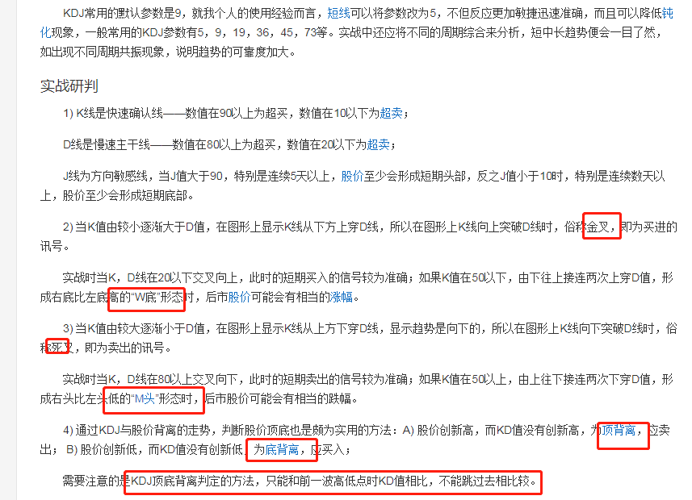
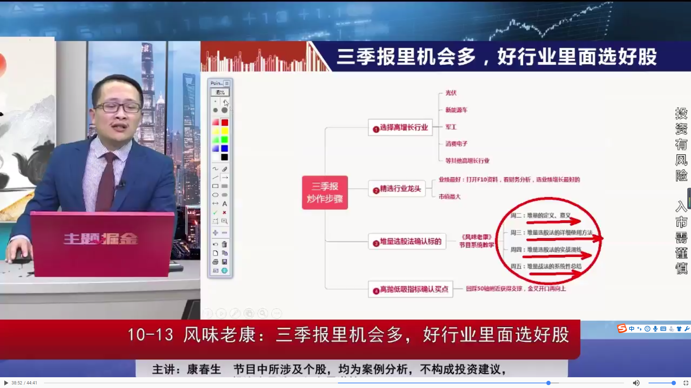
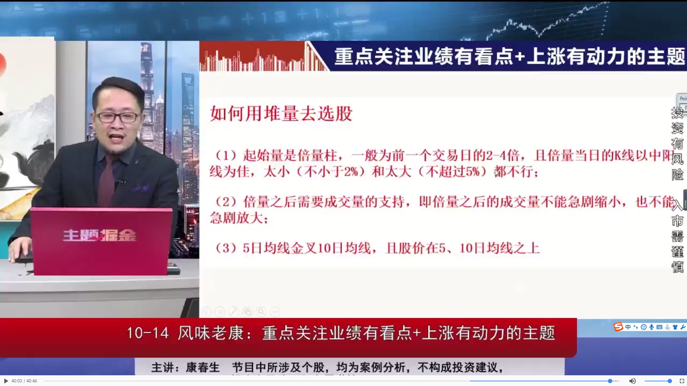

## 日线

## 周线 
周K线里也有5移动平bai均线，在这里的意思du是：每一个K线代表一周．zhi是连续5周的平均走势．实际上计算是从1～5周设定第一个平均点，2～6周设定第二个点，3～7周设定第三个点，以此类推下去，将各个点用线段连起，就是周K线的5移动平均线走势。


## 减持回购
1. 减持
2. 股票回购是指上市公司利用现金等方式，从股票市场上购回本公司发行在外的一定数额的股票的行为。

## 股票融资
1. 股票融资是指资金不通过金融中介机构，借助股票这一载体直接从资金盈余部门流向资金短缺部门，资金供给者作为所有者（股东）享有对企业控制权的融资方式，它的目的是为了满足广大投资者增加融资渠道，它的优点是筹资风险小。


## 股权质押
其实很好理解，股权质押就是将股票作为标的物，从而换取资金的行为。A拥有某股票，B拥有大量资金；某天A急需资金（股权质押手续简单，资金到账快），B有能力提供资金，这样一来A、B能够达成协议：A按股票市值的30%换取现金，到某年某日进行回购；B设置预警线和平仓线，若股价下跌到预警线时，A未能补仓或回购，那么A就违约了，B有权在股价下跌至平仓线时将质押的股票在二级市场上抛售，换取资金。

链接：https://www.zhihu.com/question/293986997/answer/621549896

## 市盈率
1. 市盈率=普通股每股市场价格÷普通股每年每股盈利。每股盈利的计算方法，是该企业在过去12个月的净收入除以总发行已售出股数。市盈率越低，代表投资者能够以较低价格购入股票以取得回报。设某股票的市价为24元，而过去12个月的每股盈利为3元，则市盈率为24/3=8。该股票被视为有8倍的市盈率，即每付出8元可分享1元的盈利。

## 市净率
1. 市净率指的是每股股价与每股净资产的比率。市净率大于1，股票市价大于每股净资产，a股比较常见。 市净率小于1，股票市价低于每股净资产，称为破净。 市净率估值法比较适合分析钢铁煤炭，这类周期股的投资机会。

## Kdj金叉
`https://baike.baidu.com/item/KDJ%E6%8C%87%E6%A0%87/6328421?fromtitle=kdj&fromid=3423560&fr=aladdin`  

1. kdj金叉 当K值由较小逐渐大于D值，在图形上显示K线从下方上穿D线，所以在图形上K线向上突破D线时，俗称金叉，即为买进的讯号。  

2. K线是快速确认线——数值在90以上为超买，数值在10以下为超卖；  

3. D线是慢速主干线——数值在80以上为超买，数值在20以下为超卖；  

4. J线为方向敏感线，当J值大于90，特别是连续5天以上，股价至少会形成短期头部，反之J值小于10时，特别是连续数天以上，股价至少会形成短期底部。


## 外盘和内盘

1. 内盘是什么意思？内盘是指以买入价格成交的数量，即**卖方主动以低于或等于当前**买一、买二、买三等价格下单卖出股票时成交的数量，用绿色显示。**内盘的多少显示了空方急于卖出的能量大小**。  

2. 外盘是什么意思？外盘是指以卖出价格成交的数量，即**买方主动以高于或等于当前**卖一、卖二、卖三等价格下单买入股票时成交的数量，用红色显示。**外盘的多少显示了多方急于买入的能量大小**。  

3. 委托以卖方价格成交的纳入“外盘”;委托以买方价格成交的纳入“内盘”。  

4. “外盘”和“内盘”相加称为成交量。分析时由于卖方成交的委托纳入“外盘”，**如“外盘”很大意味着多数卖的价位都有人来接，显示买势强劲**;  

5. 而以买方成交的纳入“内盘”，**如“内盘”过大，则意味着大多数的买入价都有人愿意卖，显示卖方力量较大**;  

6. 如内外盘大体相当，则买卖方力量相当。


## 流通股
1. 流通股是指上市公司股份中，可以在交易所流通的股份数量。其概念，是相对于证券市场而言的。在可流通的股票中，按市场属性的不同可分为A股、B股、法人股和境外上市股。与流通股对应的，还有非流通股，非流通股股票主要是指暂时不能上市流通的国家股和法人股。

## 大盘股
1. 大盘股( large-cap share)是市值总额达20亿元以上的大公司所发行的股票。资本总额的计算为公司现有股数乘以股票的市值。

## 蓝筹股
1. 蓝筹股（Blue Chips）是指长期稳定增长的、大型的、传统工业股及金融股。“蓝筹”一词源于西方赌场，在西方赌场中，有三种颜色的筹码、其中蓝色筹码最为值钱。证券市场上通常将那些经营业绩较好，具有稳定且较高的现金股利支付的公司股票称为“蓝筹股”。


## 红筹股
1. 指在中国境外注册、在香港上市的带有中国大陆概念的股票。“带有中国大陆概念”主要指中资控股和主要业务在中国大陆。

## 白马股
1. 白马股，是指长期绩优、回报率高并具有较高投资价值的股票。因其有关的信息已经公开，业绩较为明朗，同时又兼有业绩优良、高成长、低风险的特点，因而具备较高的投资价值，往往为投资者所看好。

## 除权 XR
1. 除权（exit right，XR）涉及两种情况：

2. **一种是指股票的发行公司依一定比例分配股票给股东，作为股票股利，此时增加公司的总股数**，还有一种是指股票的发行公司向股东配股。派发股票股利的 [1]  举例如下：配股比率为25/1000，表示原持有1000股的股东，在除权后，股东持有股数会增加为1025股。此时，公司总股数则膨胀了2.5%。配股的意思即是公司向老股东发行股票。

3. 除了股票股利之外，**发行公司也可分配“现金股利”给股东，此时则称为除息**。（红利分为股票红利与现金红利，**分配股票红利对应除权，分配现金红利对应除息**。）

4. **除权**是由于公司股份数量增加，**每股**股票所代表的企业**实际价值(每股净资产)有所减少**，需要在发生该事实之后从股票市场价格中剔除这部分因素，而形成的**剔除行为**。

5. 上市公司以股票股利分配给股东，也就是公司的盈余转为增资时，或进行配股时，就要对股价进行除权。上市公司将盈余以现金分配给股东，股价就要除息。  
**除权**产生是因为投资人在除权之前与当天购买者，两者买到的是同一家公司的股票，但是内含的权益不同，显然相当不公平。因此，必须在除权当天向下调整股价，成为除权参考价。


## 除权除息 DR
1. 除权除息是上市公司以股票股利分配给股东，也就是公司的**盈余转为增资时，或进行配股时，就要对股价进行除权（XR）**，XR是EXCLUDE（除去）RIGHT（权利）的简写。上市公司将盈余以**现金分配给股东，股价就要除息（XD）**，XD是EXCLUDE（除去）DIVIDEND（利息）的简写。 除权除息日购入该公司股票的股东则不可以享有本次分红派息或配股

## 股票除息
1. 股票除息是在股票发行公司给股东发放股息红利期间，该股票的上市交易价格一般须除去发行公司发放给股东的那部分股息的红利，这就是股票除息的含义。

2. **股票除息就是股票前一日的收盘价,减去上市公司要发放的股息,就叫除息.**

3. 新买进股票的持有者因没有过户就不能享有领取股息红利的权利，这就称为除息。同时股票买卖价格就应扣除这段时期内应发放股息红利数，这就是除息交易。

>除息报价 = 除息交易日收盘价 - 应发放现金红利


## 字母代表
```
ST，这是对连续两个会计年度都出现亏损的公司施行的特别处理。ST即为亏损股。

*ST，是连续三年亏损，有退市风险的意思，购买这样的股票要有比较好的基本面分析能力。

N，新股上市首日的名称前都会加一个字母N，即英文NEW的意思。

S*ST，指公司经营连续三年亏损，进行退市预警和还没有完成股改。

SST，指公司经营连续二年亏损进行的特别处理和还没有完成股改。

S，还没有进行或完成股改的股票。

NST，经过重组或股改重新恢复上市的ST股。

PT，退市的股票。
```

## 基本长常识
```
总手是今天累计成交手数

现手是刚成交的手数

外盘是主动性买盘

内盘是主动性卖盘


量比是一个衡量相对成交量的指标，它是开市后每分钟的平均成交量与过去5个交易日每分钟平均成交量之比。
量比＝现成交总手/（过去5日平均每分钟成交量×当日累计开市时间（分））
当量比大於1时，说明当日每分钟的平均成交量要大於过去5日的平均数值，交易比过去5日火爆；
而当量比小於1时，说明现在的成交比不上过去5日的平均水平。

```


```
委比是衡量一段时间内场内买、卖盘强弱的技术指标。
它的计算公式为：委比＝（委买手数－委卖手数）／（委买手数＋委卖手数）×100％
委比”的取值范围从－100％至＋100％。若“委比”为正值，说明场内买盘较强，且数值越大，买盘就越强劲。
反之，若“委比”为负值，则说明市道较弱。

某股即时最高买入委托报价及委托量为15．00元、130手，向下两档分别为14．99元、150手，14．98元、205手；
最低卖出委托报价及委托量分别为15．01元、270手，向上两档分别为15．02元、475手，15．03元、655手，
则此时的即时委比为－48．54％。显然，此时场内抛压很大。
```

## 堆量
1. 放量
2. 有序

## 高抛低吸指标（老康）

## 选股示例


