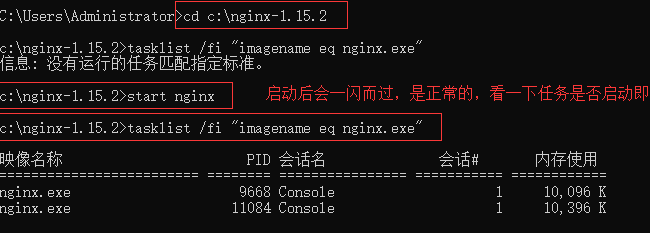

## Nginx配置
#### Nginx是一个高性能的HTTP和反向代理服务器。是一种轻量级的Web服务器，可以作为独立的服务器部署网站（类似Tomcat）。有高性能和低消耗内存的结构。

1. 先去官网下载Nginx包。（注意分清Linux和Windows版本）
2. 下载完成后，解压缩，解压后的文件夹直接放入C盘（C:\nginx），运行cmd进到nginx目录下，使用命令进行启动，**不要直接双击nginx.exe，不要直接双击nginx.exe，不要直接双击nginx.exe**。
3. 启动命令 `start nginx`。
4. 查看任务进程是否存在，dos或打开任务管理器都行 `tasklist /fi "imagename eq nginx.exe"` 



5. nginx下面logs文件下的error.log为日志文件。
>(1) 端口号被占用  
(2) nginx文件夹路径含中文

6. 修改配置文件，进入解压缩目录，在conf目录下找到nginx.conf使用txt文本打开即可，找到server这个节点，修改端口号等操作。
>listen 监听端口
location下的root为默认主页html

7. 修改完成后保存，使用以下命令检查一下配置文件是否正确，后面是nginx.conf文件的路径，successful就说明正确了  **检查配置文件是否正确命令**`nginx -t -c /nginx-1.15.2/conf/nginx.conf`

8. 如果程序没启动就直接start nginx启动，如果已经启动了就使用以下命令重新加载配置文件并重启  **重启命令**`nginx -s reload`

9. 打开浏览器访问刚才的域名及端口，例如http://localhost:8800，出现欢迎页就说明部署成功了。

10. 关闭nginx `nginx -s stop`

11. 完整有序的关闭 `nginx -s quit` 


#### 优化配置
```
#user  nobody;

#==工作进程数，一般设置为cpu核心数
worker_processes  1;

#error_log  logs/error.log;
#error_log  logs/error.log  notice;
#error_log  logs/error.log  info;

#pid        logs/nginx.pid;


events {

    #==最大连接数，一般设置为cpu*2048
    worker_connections  1024;
}


http {
    include       mime.types;
    default_type  application/octet-stream;

    #log_format  main  '$remote_addr - $remote_user [$time_local] "$request" '
    #                  '$status $body_bytes_sent "$http_referer" '
    #                  '"$http_user_agent" "$http_x_forwarded_for"';

    #access_log  logs/access.log  main;

    sendfile        on;
    #tcp_nopush     on;

    #keepalive_timeout  0;
    
    #==客户端链接超时时间
    keepalive_timeout  65;

    #gzip  on;

    #当配置多个server节点时，默认server names的缓存区大小就不够了，需要手动设置大一点
    server_names_hash_bucket_size 512;

    #server表示虚拟主机可以理解为一个站点，可以配置多个server节点搭建多个站点
    #每一个请求进来确定使用哪个server由server_name确定
    server {
        #站点监听端口
        listen       8800;
        #站点访问域名
        server_name  localhost;
        
        #编码格式，避免url参数乱码
        charset utf-8;

        #access_log  logs/host.access.log  main;

        #location用来匹配同一域名下多个URI的访问规则
        #比如动态资源如何跳转，静态资源如何跳转等
        #location后面跟着的/代表匹配规则
        location / {
            #站点根目录，可以是相对路径，也可以使绝对路径
            root   html;
            #默认主页
            index  index.html index.htm;
            
            #转发后端站点地址，一般用于做软负载，轮询后端服务器
            #proxy_pass http://10.11.12.237:8080;

            #拒绝请求，返回403，一般用于某些目录禁止访问
            #deny all;
            
            #允许请求
            #allow all;
            
            add_header 'Access-Control-Allow-Origin' '*';
            add_header 'Access-Control-Allow-Credentials' 'true';
            add_header 'Access-Control-Allow-Methods' 'GET, POST, OPTIONS';
            add_header 'Access-Control-Allow-Headers' 'DNT,X-CustomHeader,Keep-Alive,User-Agent,X-Requested-With,If-Modified-Since,Cache-Control,Content-Type';
            #重新定义或者添加发往后端服务器的请求头
            #给请求头中添加客户请求主机名
            proxy_set_header Host $host;
            #给请求头中添加客户端IP
            proxy_set_header X-Real-IP $remote_addr;
            #将$remote_addr变量值添加在客户端“X-Forwarded-For”请求头的后面，并以逗号分隔。 如果客户端请求未携带“X-Forwarded-For”请求头，$proxy_add_x_forwarded_for变量值将与$remote_addr变量相同  
            proxy_set_header X-Forwarded-For $proxy_add_x_forwarded_for;
            #给请求头中添加客户端的Cookie
            proxy_set_header Cookie $http_cookie;
            #将使用代理服务器的主域名和端口号来替换。如果端口是80，可以不加。
            proxy_redirect off;
            
            #浏览器对 Cookie 有很多限制，如果 Cookie 的 Domain 部分与当前页面的 Domain 不匹配就无法写入。
            #所以如果请求 A 域名，服务器 proxy_pass 到 B 域名，然后 B 服务器输出 Domian=B 的 Cookie，
            #前端的页面依然停留在 A 域名上，于是浏览器就无法将 Cookie 写入。
            
　　         #不仅是域名，浏览器对 Path 也有限制。我们经常会 proxy_pass 到目标服务器的某个 Path 下，
            #不把这个 Path 暴露给浏览器。这时候如果目标服务器的 Cookie 写死了 Path 也会出现 Cookie 无法写入的问题。
            
            #设置“Set-Cookie”响应头中的domain属性的替换文本，其值可以为一个字符串、正则表达式的模式或一个引用的变量
            #转发后端服务器如果需要Cookie则需要将cookie domain也进行转换，否则前端域名与后端域名不一致cookie就会无法存取
　　　　　　  #配置规则：proxy_cookie_domain serverDomain(后端服务器域) nginxDomain(nginx服务器域)
            proxy_cookie_domain localhost .testcaigou800.com;
            
            #取消当前配置级别的所有proxy_cookie_domain指令
            #proxy_cookie_domain off;
            #与后端服务器建立连接的超时时间。一般不可能大于75秒；
            proxy_connect_timeout 30;
        }

        #error_page  404              /404.html;

        # redirect server error pages to the static page /50x.html
        #
        error_page   500 502 503 504  /50x.html;
        location = /50x.html {
            root   html;
        }

    }
    
　　#当需要对同一端口监听多个域名时，使用如下配置，端口相同域名不同，server_name也可以使用正则进行配置
　　#但要注意server过多需要手动扩大server_names_hash_bucket_size缓存区大小
　　server {
　　　　listen 80;
　　　　server_name www.abc.com;
　　　　charset utf-8;
　　　　location / {
　　　　　　proxy_pass http://localhost:10001;
　　　　}
　　}
　　server {
　　　　listen 80;
　　　　server_name aaa.abc.com;
　　　　charset utf-8;
　　　　location / {
　　　　　　proxy_pass http://localhost:20002;
　　　　}
　　}
}
```