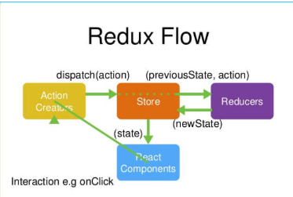

## Redux
#### JavaScript状态容器，提供可预测化的状态管理
web应用是一个状态机，视图与状态是一一对应的所有的状态都保存在一个对象里面
## 基本用法 API
1. store（容器）保存数据的地方，利用createStore生成store
```
import { createStore } from 'redux'
const store = createStore(fn)
接受另一个函数作为参数，返回新生成的store对象
```

2. state组件内部的状态，store包含的所有对象，得到数据store.getState()
```
import { createStore } from 'redux';
const store = createStore(fn);

const state = store.getState();
一个state只对应一个view
```
3. action组件动作，相应的改变组件内部的状态值（ View 发出的通知，表示 State 应该要发生变化了）
```				
	state的变化会导致view的变化，state的变化必须是view导致
	Action 就是 View 发出的通知，表示 State 应该要发生变化了。
	const action = {
  		type: 'ADD_TODO',
  		payload: 'Learn Redux'
	};
	Actioc会运送数据到 Store


    view发送多少信息，就会有多少的action，定义一个action函数 。此时就是action creator
	const ADD_TODO = '添加 TODO';
	function addTodo(text) {
  	return {
    	type: ADD_TODO,
    	text
  		}
	}
	const action = addTodo('Learn Redux');
```
4. dispatch发出相应的动作，store.dispatch( )，是view发出action的唯一方法
```
import { createStore } from 'redux';
const store = createStore(fn);

store.dispatch({
  type: 'ADD_TODO',
  payload: 'Learn Redux'
});
```
5. Reducer是一个函数，它接受 Action 和当前 State 作为参数，返回一个新的 State。
```
const reducer = function (state, action) {
  // ...
  return new_state;
}


store收到Action的时候，必须给出一个新的state，这样view才会变化。这种 State 的计算过程就叫做 Reducer。
const defaultState = 0;
const reducer = (state = defaultState, action) => {
  switch (action.type) {
    case 'ADD':
      return state + action.payload;
    default: 
      return state;
  }
};

const state = reducer(1, {
  type: 'ADD',
  payload: 2
});
```
6. store.subscribe() 设置监听方法，一旦state发生变化，就会自动执行这个函数要把 View 的更新函数（对于 React 项目，就是组件的render方法或setState方法）放入listen，就会实现 View 的自动渲染。
```
import { createStore } from 'redux';
const store = createStore(reducer);
store.subscribe(listener);

function listerner() {
  let newState = store.getState();
  component.setState(newState);   
}
```
7. store.subscribe方法返回一个函数，调用这个函数就可以解除监听。
```
let unsubscribe = store.subscribe(() =>
  console.log(store.getState())
);

unsubscribe();
```
## 基本用法 流程
图示  
  
`store` ➡️ `dispatch` ➡️ `action` ⬅️ `reducer`

文字描述
1. 用户发出 Action。   `store.dispatch(action);`
2. Store 自动调用 Reducer，并且传入两个参数：当前 State 和收到的 Action。 Reducer 会返回新的 State,`let nextState = todoApp(previousState, action);`
3. State 一旦有变化，Store 就会调用监听函数
`// 设置监听函数   store.subscribe(listener);`
4. istener可以通过store.getState()得到当前状态。如果使用的是 React，这时可以触发重新渲染 View。
function listerner() {
  let newState = store.getState();
  component.setState(newState);   
}

注意点
```
Reducer 是纯函数，就可以保证同样的State，必定得到同样的 View。但也正因为这一点，Reducer 函数里面不能改变 State，必须返回一个全新的对象，请参考下面的写法

// State 是一个对象
function reducer(state, action) {
  return Object.assign({}, state, { thingToChange });
  // 或者
  return { ...state, ...newState };
}

// State 是一个数组
function reducer(state, action) {
  return [...state, newItem];
}
```

## 中间与异步
#### 中间件是一个函数，对store.dispatch方法进行了改造，在发生action和执行reducer之间，添加了其他功能
```
let next = store.dispatch;
store.dispatch = function dispatchAndLog(action) {
  console.log('dispatching', action);
  next(action);
  console.log('next state', store.getState());
}
```
#### 中间件的用法
- ctreate可以接受整个应用的初试状态作为参数
- 中间件讲究有次序
```
import { applyMiddleware, createStore } from 'redux';
import createLogger from 'redux-logger';
const logger = createLogger();

const store = createStore(
  reducer,
  applyMiddleware(logger)
);
```
- applyMiddleware（）方法，redux的原生方法，将所有的中间件组成一个数组。依次执行所有的中间件，全部被放进一个chaid数组中，然后嵌套执行，最后执行store.dispatch

#### 异步操作的思路
1. 同步操作只要发出一种action，异步操作的差别是它要发出三种action
```
操作发起的action
操作成功时的action
操作失败时的action
// 写法一：名称相同，参数不同
{ type: 'FETCH_POSTS' }
{ type: 'FETCH_POSTS', status: 'error', error: 'Oops' }
{ type: 'FETCH_POSTS', status: 'success', response: { ... } }

// 写法二：名称不同
{ type: 'FETCH_POSTS_REQUEST' }
{ type: 'FETCH_POSTS_FAILURE', error: 'Oops' }
{ type: 'FETCH_POSTS_SUCCESS', response: { ... } }
				state
					let state = {
 // ... 
isFetching: true,
didInvalidate: true,
lastUpdated: 'xxxxxxx'
};
```
2. State 的属性isFetching表示是否在抓取数据。didInvalidate表示数据是否过时，lastUpdated表示上一次更新时间。
3. 操作开始时，送出一个 Action，触发 State 更新为"正在操作"状态，View 重新渲染
操作结束后，再送出一个 Action，触发 State 更新为"操作结束"状态，View 再一次重新渲染


#### 异步操作的解决方案
1. redux-thunk
	- Action Creator返回函数，然后使用redux-thunk中间件改造store.dispatch
	- 使用redux-thunk中间件，改造store.dispatch，使得后者可以接受函数作为参数。
2. redu-propmise这个中间件使得store.dispatch方法可以接受 Promise 对象作为参数
	- Action Creator 返回一个 Promise 对象，它 resolve 以后的值应该是一个 Action 对象，会被dispatch方法送出（action.then(dispatch)），但 reject 以后不会有任何动作
	- Action 对象的payload属性是一个 Promise 对象。需要从redux-actions模块引入createAction方法。如果 Action 对象的payload属性是一个 Promise 对象，那么无论 resolve 和 reject，dispatch方法都会发出 Action。


## react-redux用法
#### 注意点：一个组件既有UI又有业务逻辑。将它拆分成下面的结构：外面是一个容器组件，里面包了一个UI 组件。前者负责与外部的通信，将数据传给后者，由后者渲染出视图
#### UI组件（纯组件）  
只负责 UI 的呈现，不带有任何业务逻辑  
没有状态（即不使用this.state这个变量）  
所有数据都由参数（this.props）提供  
不使用任何 Redux 的 API  
```
	const Title =value => <h1>{value}</h1>;
```
			
#### 容器组件
1. 负责管理数据和业务逻辑，不负责 UI 的呈现带有内部状态使用 Redux 的 API
#### connect()  连接UI，容器
（1）输入逻辑：外部的数据（即state对象）如何转换为 UI 组件的参数

（2）输出逻辑：用户发出的动作如何变为 Action 对象，从 UI 组件传出去。`import { connect } from 'react-redux'`
```
const VisibleTodoList = connect(
  mapStateToProps,（前者负责输入逻辑，即将state映射到 UI 组件的参数（props））
  mapDispatchToProps（者负责输出逻辑，即将用户对 UI 组件的操作映射成 Action）
)(TodoList)
```


#### mapStateToProps() 建立一个从（外部的）state对象到（UI 组件的）props对象的映射关系。
1. mapStateToProps执行后应该返回一个对象，里面的每一个键值对就是一个映射
```
const mapStateToProps = (state) => {
  return {
    todos: getVisibleTodos(state.todos, state.visibilityFilter)
  }
}
```

2. mapStateToProps是一个函数，它接受state作为参数，返回一个对象。这个对象有一个todos属性，代表 UI 组件的同名参数，后面的getVisibleTodos也是一个函数，可以从state算出 todos 的值
```
const getVisibleTodos = (todos, filter) => {
  switch (filter) {
    case 'SHOW_ALL':
      return todos
    case 'SHOW_COMPLETED':
      return todos.filter(t => t.completed)
    case 'SHOW_ACTIVE':
      return todos.filter(t => !t.completed)
    default:
      throw new Error('Unknown filter: ' + filter)
  }
}
```
3. mapStateToProps会订阅 Store，每当state更新的时候，就会自动执行，重新计算 UI 组件的参数，从而触发 UI 组件的重新渲染。mapStateToProps的第一个参数总是state对象，还可以使用第二个参数，代表容器组件的props对象。使用ownProps作为参数后，如果容器组件的参数发生变化，也会引发 UI 组件重新渲染。

4. connect方法可以省略mapStateToProps参数，那样的话，UI 组件就不会订阅Store，就是说 Store 的更新不会引起 UI 组件的更新。
```
const mapStateToProps = (state, ownProps) => {
  return {
    active: ownProps.filter === state.visibilityFilter
  }
}
```


#### mapDispatchToProps()	                                    
建立 UI 组件的参数到store.dispatch方法的映射。也就是说，它定义了哪些用户的操作应该当作 Action，传给 Store。它可以是一个函数，也可以是一个对象。
1. 函数  
dispatch和ownProps（容器组件的props对象）两个参数mapDispatchToProps作为函数，应该返回一个对象，该对象的每个键值对都是一个映射，定义了 UI 组件的参数怎样发出 Action。
```
const mapDispatchToProps = (
  dispatch,
  ownProps
) => {
  return {
    onClick: () => {
      dispatch({
        type: 'SET_VISIBILITY_FILTER',
        filter: ownProps.filter
      });
    }
  };
}
```
2. 对象  
键名也是对应 UI 组件的同名参数，键值应该是一个函数，会被当作 Action creator ，返回的 Action 会由 Redux 自动发出
```
const mapDispatchToProps = {
  onClick: (filter) => {
    type: 'SET_VISIBILITY_FILTER',
    filter: filter
  };
}
```
#### Provider
connect方法生成容器组件以后，需要让容器组件拿到state对象，才能生成 UI 组件的参数。  

一种解决方法是将state对象作为参数，传入容器组件。但是，这样做比较麻烦，尤其是容器组件可能在很深的层级，一级级将state传下去就很麻烦。  

React-Redux 提供Provider组件，可以让容器组件拿到state  
```
import { Provider } from 'react-redux'
import { createStore } from 'redux'
import todoApp from './reducers'
import App from './components/App'

let store = createStore(todoApp);

render(
  <Provider store={store}>
    <App />
  </Provider>,
document.getElementById('root') 
```

## react-router
- 使用React-Router的项目，与其他项目没有不同之处，也是使用Provider在Router外面包一层，毕竟Provider的唯一功能就是传入store对象。
```
const Root = ({ store }) => (
  <Provider store={store}>
    <Router>
      <Route path="/" component={App} />
    </Router>
  </Provider>
);
```